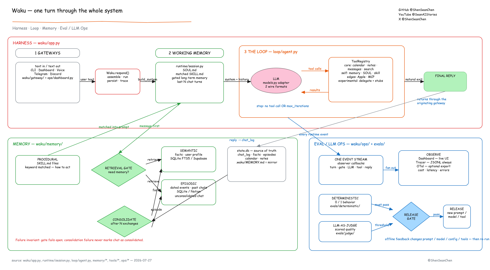
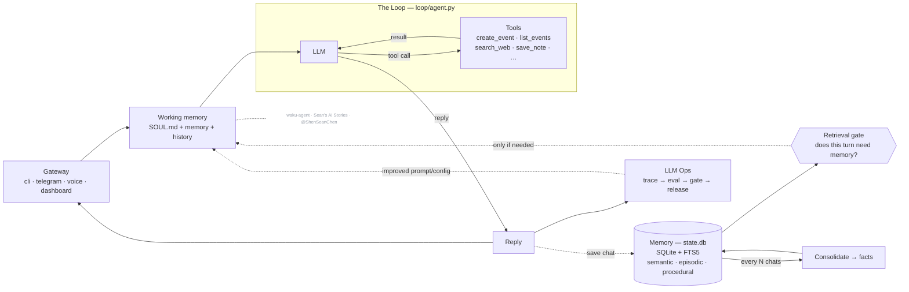
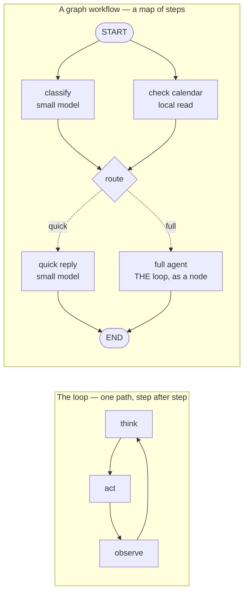

<picture>
  <source media="(prefers-color-scheme: dark)" srcset="docs/brand/waku-mark-on-dark.svg">
  
</picture>

# waku-agent

**Your own AI assistant. On your laptop. In code you can read in an afternoon.**

Meet **Waku** — a local-first personal assistant that shows the four pillars behind every
serious agent: **Harness · Loop · Memory · Eval/LLM-Ops**. No frameworks hiding the good parts.
Built by [seanchen.io](https://seanchen.io).

- **Local-first.** Your memory is one SQLite file. Open it. Read it. It's yours.
- **Memory is the hero.** Semantic + episodic + procedural — with a gate that decides *whether*
  to remember, and a pass that decides *what* to keep.
- **The loop is ~95 lines** of plain Python. Step through it.
- **Watch it think.** A local dashboard lights up every message as it flows through the harness.
- **Eval built in.** Deterministic tests *and* LLM-as-judge, side by side, with a release gate.



> The system-design whiteboard from the series.
> Every box maps to a file — see [the architecture](docs/architecture.md).

**▶ [Watch the 20-min code walkthrough](https://www.youtube.com/watch?v=rvRyBhILrls&list=PLE9hy4A7ZTmpGq7GHf5tgGFWh2277AeDR&index=42)** — the loop, the memory pillars, the evals, the Telegram gateway and the "Waku Waku" wake word, live.

**[Waku Memory](https://www.waku.one)** — the same memory in Claude Code, Codex, Grok Bot and this agent: [waku.one](https://www.waku.one) · [docs](https://www.waku.one/docs)

[YouTube](https://www.youtube.com/@SeanAIStories) · [X](https://x.com/ShenSeanChen) · [LinkedIn](https://linkedin.com/in/shen-sean-chen) · [Instagram](https://www.instagram.com/sean_ai_stories) · [TikTok](https://www.tiktok.com/@sean_ai_stories) · [Discord](https://discord.gg/ebbdvSCXqu) ·
[哔哩哔哩](https://space.bilibili.com/479332937) · [小红书](https://www.xiaohongshu.com/user/profile/5cf02cfb0000000005014371) · [抖音](https://www.douyin.com/user/MS4wLjABAAAAWCkd62_e8q4n-S34LIL04HsYN3m03l8MFdVYZToojP8)

### [Buy me a coffee](https://buy.stripe.com/5kA176bA895ggog4gh) — it keeps this repo (and the videos) coming

## Quickstart

Just want to run it:

```bash
pip install waku-agent
waku                                    # talk to your Waku in the terminal
waku dashboard                          # …or the browser cockpit → localhost:7777
```

It will tell you which key to set the first time. Want to **read the code** (the
point of this repo) or contribute — clone it instead:

```bash
git clone https://github.com/ShenSeanChen/waku-agent && cd waku-agent
uv venv && uv pip install -e .          # create the env + install the `waku` command
cp .env.example .env                    # pick a provider, paste ONE key
uv run waku                             # talk to your Waku in the terminal
uv run waku dashboard                   # …or the browser cockpit → localhost:7777
```

**Now try it.** *"Remember that Alex prefers morning meetings."* Quit. Restart.
*"Book a catch-up with Alex on Friday."* → it remembers, and books 9am. Your memory is one
file: `.waku/state.db`.

**Use the model you already pay for.** Anthropic (default), OpenAI, Gemini, DeepSeek, MiniMax,
Kimi, GLM, OpenRouter (one key, hundreds of hosted models), OpenCode Zen, or OpenCode Go —
set `WAKU_PROVIDER=`, paste the key, done. One dialect in the loop;
a [~60-line adapter](waku/loop/models.py) handles the rest.

Already use OpenCode locally? [Connect its local server](docs/opencode-local.md)
with `WAKU_PROVIDER=opencode_local`; provider credentials stay in OpenCode.

## Watch the harness run — the dashboard

```bash
waku dashboard          # starts a local server → http://localhost:7777
```

A small web server you own (`127.0.0.1`, no cloud). The browser is just the UI — the same
process runs every turn. This is the fastest way to *get* the system.

A chat dock sits on every tab. Type or **speak**, and watch it flow through the harness on the
Overview diagram: gate lights up → loop calls a tool → reply comes back → memory updates. The
frontend is plain static files. No build step.

Each tab is one pillar, linked to the real files:

| Tab | What you see |
|---|---|
| **Overview** | cost, latency, the gate skip/retrieve split, the clickable architecture map |
| **Gateway** | one conversation across every channel, each message tagged by source (dashboard / telegram / voice / cli) |
| **Loop** | every turn with its gate decision, tool calls, tokens, and cost |
| **Graph** | graph workflows: the live triage topology (drawn from the engine itself) + which door each turn took |
| **Memory** | sub-tabs per pillar — semantic facts, episodes, editable skills + SOUL, consolidation |
| **Tools** | the agent's available tools (grouped by origin), its results, and MCP connectors |
| **Data** | a live SQLite browser: per-table tabs, schema, and a read-only SQL console over `state.db` |
| **Ops** | eval verdict + history, the gate decisions, slowest turns, and inline JSONL traces |

The sidebar and chat dock are drag-resizable and hideable, and the chat has *New chat* +
history like any chat app.

## Things to try (each shows off a pillar)

Type these in the chat dock (or `make run`) and watch the dashboard light up:

| Try this | What it shows | Where to watch |
|---|---|---|
| *"Schedule a tennis game with Raj this Saturday at 8am"* | the Loop calls a tool (`create_event`) | the **LOOP** box pulses; **Loop** tab shows `iter 2` |
| *"What's on my calendar today?"* | reading the calendar (`list_events`) | it answers from `state.db`, no made-up events |
| *"When am I swimming with Sergey?"* then *"what's 12 × 8?"* | the **retrieval gate** — retrieve vs skip | Overview gate bar; **Ops** shows the per-turn decision |
| *"Remember that Raj prefers evening games"* | memory self-management (`save_note`) | **Memory ▸ Semantic** gains a fact; `MEMORY.md` updates |
| *"Search for the World Cup games still left to play and add each one to my calendar"* | **multi-tool loop engineering** | **Loop** tab shows `iter 8`: `search_web` × N → `create_event` × N |
| chat from `make run` **and** the browser | one brain, many gateways | the **Gateway** tab tags each message `cli` / `dashboard` |

**The money shot** is the World Cup one. In one turn, Waku searches the web a few times, reasons
over the results, and books every remaining match — **8 loop iterations**, live. Needs a free
`TAVILY_API_KEY` (paste it in **Connections**). Watch the **LOOP** box pulse per cycle. That's loop
engineering, on tape.

## How is this different from ChatGPT / Claude Desktop?

Those are products you *use*. This is a codebase you *own* — the loop, the memory schema, the
gate, the eval harness, all yours to read and change. Understand this repo, and you understand
what the products do under the hood.

Versus the big open-source assistants (OpenClaw, Hermes)? Same architecture, 1/100th the code.
Products vs. a readable blueprint.

## The whiteboard gallery — editable system-design charts

Every whiteboard from the videos lives in [`docs/whiteboards/`](docs/whiteboards) as an
**editable `.excalidraw` source** — download one, drop it on [excalidraw.com](https://excalidraw.com),
and remix it for your own team:

| Chart | What it explains |
|---|---|
| [`k3-architecture.excalidraw`](docs/whiteboards/k3-architecture.excalidraw) | Kimi K3: the 16-of-896 MoE, KDA + AttnRes attention, why agent loops get cheap |
| [`pi-architecture.excalidraw`](docs/whiteboards/pi-architecture.excalidraw) | pi (72K-star coding agent): 4-tool core, extensions, one EventStream |
| [`waku-architecture.excalidraw`](docs/whiteboards/waku-architecture.excalidraw) | Waku itself — harness, loop, memory pillars, LLM Ops (editable rebuild of [the whiteboard](docs/architecture-whiteboard.png)) |
| [`loop-vs-graph.excalidraw`](docs/whiteboards/loop-vs-graph.excalidraw) | Loop vs graph engineering — the ladder, and two timelines from a measured run of `waku brief` against `waku gather` ([the write-up](docs/loop-vs-graph.md)) |

New charts land here with every video. If they help you,
[a star](https://github.com/ShenSeanChen/waku-agent) keeps them coming — and
[sponsoring](https://github.com/sponsors/ShenSeanChen) gets new whiteboards early.

## The whiteboard maps to the code

This diagram renders straight from the README (it's [Mermaid](https://mermaid.js.org/) text, not an
image — edit it in a PR):



> _Architecture of **waku-agent** — built on the series
> ([@ShenSeanChen](https://github.com/ShenSeanChen)). Code is MIT; **this diagram is licensed CC BY-NC-SA 4.0** —
> reuse it with credit to the channel, not for commercial resale._

Every box is one module (full version with every file path: [docs/architecture.md](docs/architecture.md)):

| Diagram box | Module |
|---|---|
| Gateway Interface (CLI / voice / Telegram / web) | [`waku/gateway/`](waku/gateway) |
| Ephemeral Agent Run → Working Memory | [`waku/runtime/session.py`](waku/runtime/session.py) |
| The Loop (LLM ↔ tools, end-loop guardrails) | [`waku/loop/agent.py`](waku/loop/agent.py) |
| Graph workflows (structure around the loop) | [`waku/graph/`](waku/graph) |
| Agentic Tools (schedule / note / message) | [`waku/tools/`](waku/tools) |
| Procedural Memory (SKILL.md, "how to act") | [`waku/memory/procedural/`](waku/memory/procedural) + [`skills/`](skills) |
| Semantic Memory (durable facts, profile) | [`waku/memory/semantic/`](waku/memory/semantic) |
| Episodic Memory (dated events, past chats) | [`waku/memory/episodic/`](waku/memory/episodic) |
| "Should we even retrieve?" gate | [`waku/memory/retrieval_gate.py`](waku/memory/retrieval_gate.py) |
| Consolidate after N chats → summarizer | [`waku/memory/consolidation.py`](waku/memory/consolidation.py) |
| Trace (1 trace per run) | [`waku/ops/tracing.py`](waku/ops/tracing.py) |
| Eval: deterministic vs LLM-as-judge | [`evals/deterministic/`](evals/deterministic) vs [`evals/judge/`](evals/judge) |
| Gate → Release | [`waku/ops/release_gate.py`](waku/ops/release_gate.py) |

**A note on `MEMORY.md` vs `state.db`.** Some assistants (e.g. Hermes) keep long-term memory as a
single `MEMORY.md` markdown file. Waku keeps the *queryable* source in `state.db` (the `facts` and
`episodes` tables, keyword-searchable via FTS5) **and** regenerates a human-readable
`.waku/MEMORY.md` mirror after every turn — so you get both: a real file you can open, backed by a
sturdy database. The dashboard's **Memory** tab is the friendly view; the **Database** tab shows the
raw `state.db` tables.

## The Loop — reason → act → repeat

Yes, there's a real agent loop, and it's [~95 lines of plain Python](waku/loop/agent.py) —
no LangGraph, no hidden control flow (and when a task needs structure *around* the loop,
that structure is another ~200 readable lines — see
[Graph workflows](#graph-workflows--when-a-turn-needs-shape) below):

```
while not done:
    response = llm(messages, tools)      # reason
    if response wants tools:
        results = run(tool_calls)        # act
        messages += results              # observe
    else:
        done                             # reply to the human
```

Two guardrails end every turn: the model stops asking for tools (natural end), or it hits
`max_iterations` (hard stop — it never spins forever). That's "loop engineering": the exit
conditions, the tool round-trip, and feeding results back as working memory.

**How to show it on camera:**
1. Type *"schedule a swim with Sergey Saturday at 5pm"* in the chat dock and watch the **LOOP**
   box on the Overview diagram light up: reason → `create_event` → reason → reply.
2. Open the **Loop** tab — every turn is listed with its gate decision, each tool call, the
   **iteration count**, tokens, and dollar cost. A tool-using turn shows `iter 2` (reason,
   act, then reason again to reply); a plain answer shows `iter 1`.
3. Open the **Ops** tab (or `.waku/traces/<today>.jsonl`) to read that same turn as raw
   events in order: `turn_start → gate → llm → tool → llm → turn_end`. That's the loop, on tape.

**The multi-tool loop (the money shot).** One tool is a loop; *chaining* tools is where loop
engineering earns its name. Try:

> *"Search for the World Cup games still left to play and add each one to my calendar."*

The agent loops across two tools: [`search_web`](waku/tools/search.py) reads the web, it
reasons over the results, then calls [`create_event`](waku/tools/calendar.py) once per match —
several iterations in a single turn. You'll see `iter 4`, `iter 5`… on the Loop tab and the
LOOP box pulse for each cycle. `search_web` works keyless via DuckDuckGo but that endpoint
rate-limits bots, so for a clean take set a free `TAVILY_API_KEY` (see [`.env.example`](.env.example)).

## Graph workflows — when a turn needs shape

The loop is one agent turn: the model picks tools until it stops, and that covers chat.
But some work has **shape** — steps that could run *at the same time*, and explicit
"if this, go here" routing. A **graph workflow** makes that shape first-class: nodes
(each does one job — a function, one LLM call, or a whole loop turn) connected by edges
(what happens next). It's an extension of the Loop pillar, not a replacement:
[`loop/agent.py`](waku/loop/agent.py) did not change one line — a graph *arranges calls
around it, and to it*. And it's still no-framework: the entire engine is
[one readable file](waku/graph/engine.py), same trick as the loop.



**The shipped example: triage.** Flip `WAKU_GRAPH_WORKFLOWS=1` (in `.env`, or the
dashboard's Settings) and *every* message enters the triage graph first — you never
choose a mode, the harness decides. A small model classifies the message **while**
today's calendar loads in parallel; *"thanks!"* gets a fast small-model reply and never
wakes the big model; *"schedule a swim Saturday"* routes into the exact same loop as
before, running as one node. Any failure anywhere — classifier, engine, anything —
**fails open** to the plain loop, so the flag can only ever save time and tokens. This
is the retrieval-gate idea generalized from one gate to a structure. (A graph is *not*
a swarm of chatting agents: the edges decide everything, deterministically — which is
why it can be traced and eval'd like everything else here.)

**How to show it on camera:**
1. Switch the flag on, then send *"thanks!"* — on **Overview**, the graph panel lights
   the quick path while the LOOP boxes stay dark: proof the big model never woke.
2. Send *"schedule a swim Saturday 9am"* — watch `route → full_agent` light up, then the
   familiar loop animation take over. Same loop, one graph node.
3. Open the **Graph** tab: the live topology there is drawn from the engine's own
   `describe()` — the picture *cannot* drift from the code. The trace
   (`.waku/traces/<today>.jsonl`) shows the run on tape:
   `graph_start → node_start … route → graph_end`.

## The two hero moments

**1. The retrieval gate.** Most agents hit their memory store on every turn. That's
slow, and worse — irrelevant memories bias answers. Here a cheap model first answers
one question: *does this message need memory at all?* Watch it in the terminal:

```
you > what's 2+2?
  gate · skip — pure math
you > when am I meeting Alex?
  gate · retrieve — references user's plans
```

**2. Deterministic eval vs LLM-as-judge.** *"Did it create the right calendar event?"*
is a unit test — 0 or 1, no model judges it (`make eval`). *"Was the reply helpful?"*
is a judged score with a threshold (`make eval-judge`). Conflating the two is the most
common eval mistake; here they're separate suites you can diff. `make gate` runs both
as a release gate.
New to it? **[Getting started](docs/getting-started.md)** walks the whole setup, with a check
at the end of every step.

## Connect Waku Memory

Waku's own memory is local. **[Waku Memory](https://www.waku.one)** is the hosted memory you
share across agents: save something in Claude Code, recall it here.

```bash
pip install 'waku-agent[mcp]'           # in a checkout: uv pip install -e '.[mcp]'
waku connect waku-memory                # or /connect waku-memory in the dashboard chat
waku skill export --to claude,codex     # carry Waku's skills to Claude Code and Codex too
```

Your browser opens once to sign in. To connect Claude Code, Codex, Hermes or Grok Bot to the
same memory, see [integrations](docs/integrations.md#share-one-memory-with-your-other-agents-waku-memory).

## What's inside

| Pillar | In one line | Read more |
|---|---|---|
| **Harness** | gateways (terminal, dashboard, voice, Telegram, Discord, WhatsApp) and tools around one loop | [architecture](docs/architecture.md) |
| **Loop** | ~95 lines of plain Python: reason, act, repeat, with two ways to stop | [the tour](docs/tour.md#the-loop) |
| **Memory** | semantic, episodic and procedural (skills); a gate decides *whether* to remember, consolidation decides *what* to keep | [the tour](docs/tour.md#the-retrieval-gate) |
| **Eval / LLM-Ops** | deterministic tests and LLM-as-judge side by side, a release gate, a trace for every turn | [evals](docs/evals.md) |

**How is this different from ChatGPT or Claude Desktop?** Those are products you *use*. This is a
codebase you *own*: the loop, the memory schema, the gate and the eval harness are all yours to
read and change. Versus the big open-source assistants (OpenClaw, Hermes)? Same architecture,
1/100th the code.

## Docs

| Read | For |
|---|---|
| [Getting started](docs/getting-started.md) | installing, the first run, connecting Waku Memory |
| [The tour](docs/tour.md) | the dashboard, things to try, the loop, graph workflows, skills |
| [Architecture](docs/architecture.md) | every box on the whiteboard, and the file behind it |
| [Integrations](docs/integrations.md) | voice, Telegram, calendars, MCP servers, Waku Memory |
| [Commands](docs/commands.md) | every `waku` and `make` command |
| [Evals & tracing](docs/evals.md) | the two kinds of eval, the release gate, traces and spend |
| [Roadmap](docs/roadmap.md) | what is live, what is still a skeleton, upgrade paths |
| [Whiteboards](docs/README.md#whiteboards) | the editable system-design charts from the videos |
| [lab/](lab/README.md) | Waku meets other agents and models: the video experiments |
| [AGENTS.md](AGENTS.md) · [CONTRIBUTING.md](CONTRIBUTING.md) | the rules, and how to send a PR |

## Community

Star the repo, join the [Discord](https://discord.gg/ebbdvSCXqu), and grab a
[good first issue](https://github.com/ShenSeanChen/waku-agent/issues?q=is%3Aissue+is%3Aopen+label%3A%22good+first+issue%22)
— that link is the live list, so it's always current. Gateways, memory backends and
community skills are all shaped to be first PRs; the easiest needs no Python at all
(see [contributing a skill](CONTRIBUTING.md)).

**Comment on an issue before you start** and it gets assigned to you, so two people
never build the same thing.

## Also from me

- **[launch-mvp-stripe-nextjs-supabase](https://github.com/ShenSeanChen/launch-mvp-stripe-nextjs-supabase)** — NextJS + Supabase + Stripe, everything you need to ship a SaaS.
- **[AutoManus.io](https://automanus.io)** — my AI startup: a sales lead manager for made-to-order products. It embeds where conversations already happen (WhatsApp, email, web chat) to capture inbound, automate follow-ups and kill CRM busywork. Pre-seed backed by Character VC. ([AutoManus Discord](https://discord.gg/SxXATg9rSK))

Code is MIT — see [LICENSE](LICENSE). The Waku name, mark and design system belong to
AutoManus Technologies, Inc. and are not MIT — see [LICENSE-BRAND](LICENSE-BRAND). Built by [@ShenSeanChen](https://github.com/ShenSeanChen)
([YouTube](https://www.youtube.com/@SeanAIStories) · [X](https://x.com/ShenSeanChen)).
